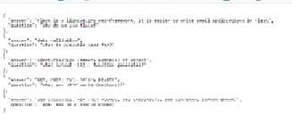

NOTES

developer notes
How to setup this project on your machine?
#output expected are below:-
1) Note:- json Data

2) Original Output

3)  Except IndexError

4) Flash Card Index start 0

5) Flash Card Index 1

6) Flash Card Index 2

7) Flash Card Index 3

7) Flash Card Index 4

8) Get Request from Postman Json

# INSTALL required libraries

pip install flask
How to run this project?
# RUN IN DEBUG MODE
flask --app main --debug run

# RUN WITHOUT DEBUG MODE
flask --app main run

# RUN ON NON_DEFAULT PORT
flask --app main --port <port-number> run 
project structure
test_flask_v2 (project root)

    - main.py
    - static (directory)
    - templates (package)
        -- __init__.py
        -- welcome.html
    - models (package)
        - __init__.py
        - dal.py
        - flashcard_db.json
    - requirements.txt
URLS used in project
http://127.0.0.1:5000/
http://127.0.0.1:5000/card/0
http://127.0.0.1:5000/card/1
http://127.0.0.1:5000/card/2
http://127.0.0.1:5000/card/3
http://127.0.0.1:5000/card/4
http://127.0.0.1:5000/card/5 (NOT FOUND)
http://127.0.0.1:5000/api/cards
Reference material for this project
JINJA templates and it's syntax

- JINJA is a package used by flask (as dependency). 
- When we use `render_template()` function from flask, we basically have to
  use JINJA template syntax.
- JINJA syntax can be referred from following link.

JINJA template syntax https://jinja.palletsprojects.com/en/2.11.x/templates/